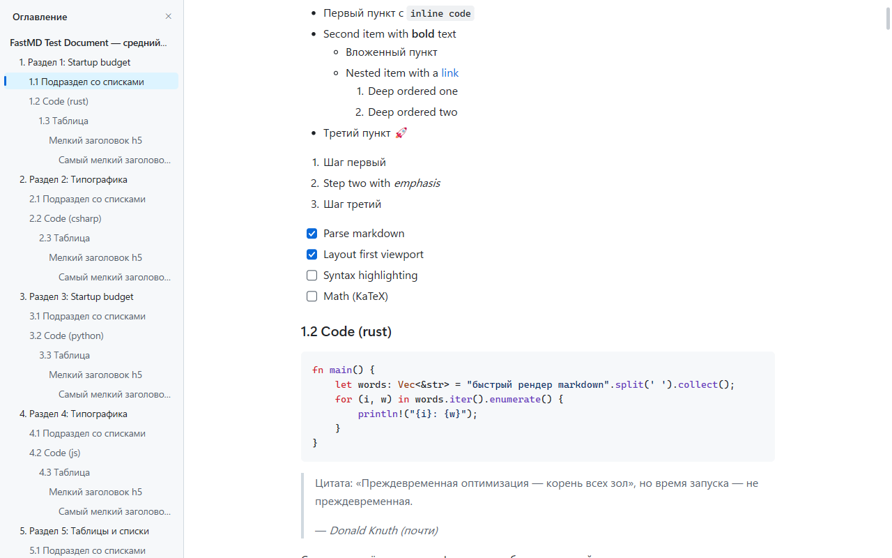

# FastMD

[English](README.md) · Русский

**Молниеносный просмотрщик Markdown для Windows.** От запуска до отрисованного документа проходит около 65 мс. Пустое окно Win32 без настройки открывается дольше.

*C++20, Win32, DirectWrite, md4c. Интерфейс говорит по-русски и по-английски.*



## Скачать

**[FastMD 1.2.0 — последний релиз](https://github.com/beanbo/FastMD/releases/latest):**
1. `FastMD-Setup.exe` — установка для одного пользователя, без прав администратора: ярлык в «Пуске», ассоциация `.md`, панель просмотра в Проводнике. Удаляется через «Параметры → Приложения».
2. Или `FastMD-1.2.0-win-x64.zip` — распакуйте куда угодно и запустите `FastMD.exe`; чтобы `.md` открывались двойным кликом, выберите в контекстном меню «Открывать .md в FastMD…» и подтвердите выбор в «Параметрах».

Exe пока не подписан, поэтому при первом запуске Windows SmartScreen может предупредить: «Подробнее» → «Выполнить в любом случае». Подпись кода ждёт сертификата (задача 5.5).

## Почему так быстро

Стек выбран по замерам: 12 прототипов, 47 вариантов, один харнесс и один протокол. Подробности — в [REPORT.md](REPORT.md). Ниже время от запуска процесса до отрисованного документа (medium.md, 53 КБ, медиана):

| Что открываем | мс |
|---|---|
| **Прототип FastMD: C++, Win32, DirectWrite, первый кадр на CPU** | **59** |
| Пустое окно Win32 без настройки | 78 |
| Qt 6 Widgets | 149 |
| WinUI 3 (C#, NativeAOT) | 324 |
| WebView2 / Tauri | 447–630 |
| Electron (класс Typora, Obsidian) | 753–903 |
| VS Code, только окно | 1 138 |

Сам FastMD в контрольном прогоне: 66,7 мс против 79,2 мс у пустого окна в тех же условиях. Все новые функции работают вне критического пути первого кадра.

Главные приёмы:

- первый кадр рисуется на CPU (DirectWrite → GDI DIB), ведь GPU-устройство до первого кадра стоило бы +150–250 мс;
- сначала верстается только первый экран, остальное делается в фоне после первого кадра;
- один маленький exe (~1,4 МБ вместе с режимом правки), статический CRT, никаких рантаймов;
- при первом показе окна отключены инициализация IME в UI-потоке и анимация открытия; поле поиска с IME живёт в отдельном потоке.

### Если запуск оказался дольше обычного

Иногда — как правило, в первый раз после установки или обновления — окно появляется заметно позже привычного. Это не FastMD: антивирус проверяет незнакомый ему exe, и делает это внутри `CreateProcessW`, ещё до того, как выполнится первая строка программы. Следующие запуски снова быстрые: результат проверки кэшируется.

Чтобы этого не случалось вовсе, добавьте папку программы в исключения антивируса. Для Microsoft Defender: «Безопасность Windows» → «Защита от вирусов и угроз» → «Параметры защиты от вирусов и других угроз» → «Управление параметрами» → «Исключения» → «Добавление или удаление исключений» → «Добавить исключение» → «Папка», и указать

```
%LOCALAPPDATA%\Programs\FastMD
```

(а если вы распаковали zip — ту папку, куда распаковали). Исключение снимает проверку только с этой папки; всё остальное на машине антивирус защищает как прежде.

## Возможности

- **Разметка:** CommonMark и GFM (таблицы, списки задач, зачёркивание, автоссылки), GitHub Alerts, сноски, YAML front matter таблицей, эмодзи-шорткоды, подсветка кода для 55 языков, цветные эмодзи, CJK.
- **Как на GitHub:** подмножество HTML (выравнивание, `<details>`, `<picture>`, таблицы, `<kbd>`, картинки в строке), SVG и бейджи, картинки из сети с дисковым кэшем.
- **Формулы и диаграммы:** `$…$` и `$$…$$` набираются по-настоящему (RaTeX, совместим с KaTeX), блок ```` ```mermaid ```` рисуется схемой — `graph` / `flowchart` укладывает свой раскладчик, остальные виды рисует библиотека. Схема занимает всю ширину окна, а если и этого мало — не ужимается до нечитаемого, а прокручивается вбок. Обе библиотеки подгружаются только у документа, где они нужны.
- **Чтение:**
  - оглавление с текущим разделом (Ctrl+Shift+O);
  - широкий код и таблицы прокручиваются вбок (Shift+колесо, тачпад);
  - ширина колонки от узкой до полной (Ctrl+Alt+← / →);
  - книжный шрифт Sitka и размер текста;
  - светлая и тёмная темы GitHub, Mica, высококонтрастная тема Windows.
- **Работа с текстом:**
  - выделение мышью и с клавиатуры (Shift+стрелки, по словам, до краёв строки и документа);
  - копирование с оформлением (HTML и RTF) и как Markdown-исходник (Ctrl+Shift+C);
  - перетаскивание текста, ссылок и картинок в другие приложения;
  - печать и экспорт в PDF (Ctrl+P, Ctrl+Shift+P) — текстом, а не картинкой;
  - флажки в списках задач отмечаются кликом прямо в файле (`- [ ]` ↔ `- [x]`): меняется только символ между скобками и только если файл на диске в точности тот, что на экране. Вне режима правки это единственный случай, когда FastMD пишет в документ.
- **Правка на месте:** двойной клик ставит курсор прямо в отрисованную страницу, сверху выезжает панель инструментов, а правки сохраняются в файл по ходу набора — см. [Правка](#правка).
- **Поиск:** Ctrl+F, учёт регистра, целые слова, метки совпадений на полосе прокрутки, ввод с IME.
- **Память:**
  - документ открывается на том месте, где вы его закрыли;
  - окно — там, где было;
  - без файла показываются недавние документы с поиском по названию; они же есть в Jump List.
- **Навигация:** якоря заголовков как на GitHub, относительные `.md` с историей «назад / вперёд», Tab по ссылкам, меню ссылки и картинки.
- **В Проводнике:** панель просмотра .md на том же движке (10–19 мс против 0,6–1,4 с у PowerToys) и эскизы-страницы вместо значка файла.
- **Окружение:**
  - установщик для одного пользователя, без прав администратора, и проверка обновлений раз в сутки (её можно выключить);
  - живая перезагрузка при изменении файла;
  - «Открыть в редакторе» с выбором редактора;
  - окно настроек, интерфейс на русском и английском;
  - чтение экранным диктором: документ, перемещение по словам, строкам, абзацам и заголовкам.

  Документ 3,7 МБ показывает первый экран за те же ~66 мс.

## Правка

FastMD правит документ там же, где показывает: страница сохраняет свой вид, никакого переключения в текстовый редактор.

- **Вход и выход.** Двойной клик по тексту, F2, карандаш справа вверху или пункт «Редактировать здесь» в контекстном меню: в этом месте появляется курсор, а сверху выезжает панель инструментов. Выходят из режима правки по Esc (когда всё открытое уже закрыто), F2 или ✕ у правого края панели.
- **Панель:** отменить и повторить, стиль абзаца (текст, заголовки 1–6), полужирный, курсив, зачёркнутый, код в строке, ссылка, маркированный, нумерованный список и список задач, цитата, блок кода, таблица, формула, диаграмма, изображение, горизонтальная линия и состояние сохранения. В узком окне остальное уходит под «…». Markdown, набранный в начале строки, тоже работает: `# `, `- `, `1. `, `> `, ```` ``` ````, `---`.
- **Формулы, диаграммы, картинки, HTML-блоки и front matter** правятся исходником: клик открывает под объектом маленький редактор, и страница перерисовывает объект по ходу набора. Ctrl+Enter оставляет правку, Esc отменяет её.
- **Клавиши:** Ctrl+B / Ctrl+I, Ctrl+K — ссылка, Ctrl+1…6 — заголовки, Ctrl+Shift+7 / 8 / 9 — списки, Ctrl+Shift+Q — цитата, Ctrl+Shift+K — блок кода, Ctrl+T — таблица, Ctrl+M — формула, Ctrl+Enter — новый абзац, Ctrl+Z / Ctrl+Y — отменить и повторить, Ctrl+S — сохранить. Полный список — в [app/README.ru.md](app/README.ru.md#режим-правки).
- **Сохранение.** Правки сохраняются сами через 0,8 с после последней (у файлов больше миллиона символов — через 2–5 с) и всегда — при выходе из режима правки, из документа и из программы. Автосохранение выключается в настройках («Автосохранение правок»): тогда сохраняет Ctrl+S, а также выход из режима правки. История отмен живёт, пока документ открыт, — через сохранения, выходы из режима правки и возвраты в него.
- **Что записывается.** Переписывается только изменённая часть файла, на месте: кодировка (UTF-8 с BOM и без, UTF-16 LE, кодовая страница ANSI), BOM, переводы строк и все байты вне правки остаются прежними. Файл из одних ASCII-символов считается UTF-8 без BOM, поэтому первый набранный в нём не-ASCII-символ делает его UTF-8. Символ, которого нет в кодовой странице файла, не записывается: полоса сверху предлагает сохранить файл в UTF-8 или убрать символ. Файл, который нельзя записать обратно в точности (двоичный, UTF-16 BE, текст, который не декодируется чисто), в режим правки не открывается.
- **Если файл изменили в другой программе.** Когда несохранённого нет, новая версия подхватывается (Ctrl+Z возвращает вашу); когда есть — полоса спрашивает, загрузить версию с диска или перезаписать её. Файл только для чтения можно править и сохранить под другим именем. Один файл правится только в одном окне FastMD.
- **Восстановление.** Прежде чем сохранение что-то перезапишет, заменяемые байты копируются в `%LOCALAPPDATA%\FastMD\recovery`, а после успешного сохранения копия удаляется. Пока правки сохранить нельзя (автосохранение выключено, конфликт, файл только для чтения или пропал), через 3 с после последней правки в ту же папку пишется их журнал. Если сохранение прервалось или правки остались в журнале, при следующем открытии файла появляется полоса: открыть копию (она ложится в `%LOCALAPPDATA%\FastMD\copies`), восстановить или удалить (в Корзину). Файлы восстановления старше 14 дней удаляются. У файла, зашифрованного EFS, они тоже шифруются; том BitLocker To Go или VeraCrypt распознать нельзя, поэтому файлы восстановления документа оттуда лежат в вашем профиле незашифрованными.
- **Ограничения.** Методы ввода CJK, панель эмодзи (Win+.) и диктовка в саму страницу не печатают: ради скорости окно запускается без IME. Латиница, кириллица, «мёртвые» клавиши и AltGr работают, а в редакторах исходника формул и диаграмм работает всё. Панель просмотра Проводника и эскизы по-прежнему только показывают.

## Приватность

FastMD не собирает и не отправляет ничего о вас: ни телеметрии, ни идентификаторов, ни аналитики. В сеть программа выходит ровно в двух случаях, и оба видны:

| Что | Когда | Куда |
|---|---|---|
| Картинки из документа | если в документе есть `http(s)`-картинка и в настройках стоит «всегда» (по умолчанию) или вы разрешили | на адреса из самого документа, только https, без cookie и авторизации |
| Проверка обновлений | раз в сутки после первого кадра, если не выключено в настройках | `api.github.com`, один GET; установщик скачивается только после вашего согласия и сверяется по SHA-256 |

Всё остальное остаётся на машине: настройки — в `HKCU\Software\FastMD`, позиции чтения и недавние документы — в `%LOCALAPPDATA%\FastMD\positions.bin`, кэш картинок — в `%LOCALAPPDATA%\FastMD\cache`, отчёты о сбоях — в `%LOCALAPPDATA%\FastMD\crashes` (никуда не отправляются), копии для восстановления и журнал несохранённых правок — в `%LOCALAPPDATA%\FastMD\recovery` (см. [Правка](#правка)). Панель просмотра в Проводнике в сеть не ходит вовсе.

Клавиши, настройки и устройство кода описаны в [app/README.ru.md](app/README.ru.md), ограничения текущей версии и план развития — в [docs/PLAN.md](docs/PLAN.md), история изменений — в [CHANGELOG.md](CHANGELOG.md).

## Сборка из исходников

Нужны Windows 10/11 x64 и Visual Studio 2022 или новее: любая редакция или Build Tools с workload «Desktop development with C++». CMake и Ninja входят в состав VS.

```powershell
pwsh -File app/build.ps1    # → app/build/Release/FastMD.exe
```

## Что в репозитории

| Путь | Что там |
|---|---|
| `app/` | сам просмотрщик |
| `REPORT.md` | итоговый отчёт о выборе стека |
| `research/` | шесть теоретических отчётов: нативные UI, веб-движки, GPU-стеки, конвейер Markdown, старт Windows-приложений, обзор продуктов |
| `bench/` | харнесс и протокол замеров, тестовый корпус, результаты, описания 12 прототипов |
| `docs/PLAN.md` | план развития |
| `docs/EDIT-MODE.md` | проект режима правки — свод правил, по которому написаны его тесты (на английском) |

## Лицензия

FastMD © 2026 seka. Распространяется по лицензии [GNU GPL v3.0](LICENSE).

В составе есть сторонние библиотеки, все под MIT:

| Библиотека | Для чего | Лицензия |
|---|---|---|
| [md4c](https://github.com/mity/md4c) | разбор Markdown | [app/third_party/md4c/LICENSE.md](app/third_party/md4c/LICENSE.md) |
| [lunasvg](https://github.com/sammycage/lunasvg) и plutovg | отрисовка SVG | [app/third_party/lunasvg/LICENSE](app/third_party/lunasvg/LICENSE) |
| RaTeX | набор формул | [app/third_party/ratex/LICENSE-ratex.txt](app/third_party/ratex/LICENSE-ratex.txt) |
| mermaid-rs-renderer | разбор Mermaid и все диаграммы, кроме схем `graph` / `flowchart` | [app/third_party/ratex/LICENSE-mermaid-rs-renderer.txt](app/third_party/ratex/LICENSE-mermaid-rs-renderer.txt) |

Шрифты KaTeX, которые вкладываются в формулы, распространяются по [SIL Open Font License](app/third_party/ratex/OFL-katex-fonts.txt).
